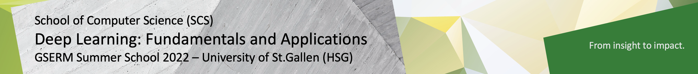

# GSERM Deep Learning: Fundamentals and Applications

Welcome to our GSERM course **Deep Learning: Fundamentals and Applications**, taught by **Prof. Dr. Damian Borth** and **Prof. Dr. Korbinan Riedhammer**.  In this course, theoretical sessions and practical hands-on coding lab sessions alternate to provide a better learning experience. The guided coding labs will be (partially) thaught by **Marco Schreyer**.

The lab materials for Python programming, Machine Learning und Deep Learning are available in and accessible through this repository.

Please use a laptop computer for the lab courses (not a tablet) to be able to fully participate in the labs.

Happy Coding!

## Course Logistics

- **Lectures:** Daily 09:15-12:30 CET, Zoom links are posted on Canvas.
- **Labs:** Daily 13:30-15:15 CET, Zoom links are posted on Canvas.
- **Zoom Videos:** Will be posted on Canvas shortly after each lecture/lab.
- **Office Hours:** Daily 16:00-17:00 CET, please send us a corresponding invitation via mail.
- **Announcements:** All course-related announcements and questions will happen on Canvas.

## Course Code Lab Notebooks 

The following table lists all lab session and coding challenge session incl. the launchers of the corresponding notebooks. In order to start the notebooks in the respective cloud environment just click on the to corresponding launchers. We aim to upload each lab notebook the day before the lab respectively.

| Date                    | Topic                            | Description                      |  Binder Notebook  | Colab Notebook    | 
|:-----------------------|:--------------------------------|:--------------------------------|:-----------------:|:-----------------:|
|  < Mon, June 20th | Prerequisite | Test Notebook | | |
|  < Mon, June 20th | Prerequisite | Python Basics | | |
|  < Mon, June 20th | Prerequisite | Python Libraries | | |
| Mon, June 20th |  Machine Learning | (Naive) Bayes Theorem  | - | - |
| Tue, June 21st |  Deep Learning    | Artificial Neural Networks (ANNs) | - | - |
| Wed, June 22nd |  Deep Learning    | Convolutional Neural Networks (CNNs) | - | - |
| Wed, June 22nd |  Deep Learning    | Autoencoder Neural Networks (AENs)| - | - |
| Thu, June 23rd |  Deep Learning    | Recurrent Neural Networks (RNNs)| - | - |
| Fri, June 24th |  Deep Learning    | Attention Neural Networks | - | - |
| < TBD          |  Assignment | - | - | - |

## Questions?

Pls. don't hesitate to send us all your questions using the course mail address: 

